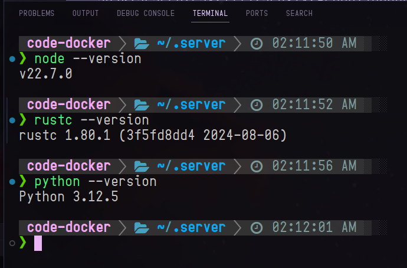

# dotfiles
My dotfiles about vscode, gnome, or other

## Firefox

## Code

Related project: [code-docker](https://github.com/qwreey/code-docker)

## zsh

A pyenv, nvm, rustup included shell environment for cygwin(msys2) and linux. project moved to [qwreey/zsh](https://github.com/qwreey/zsh)
